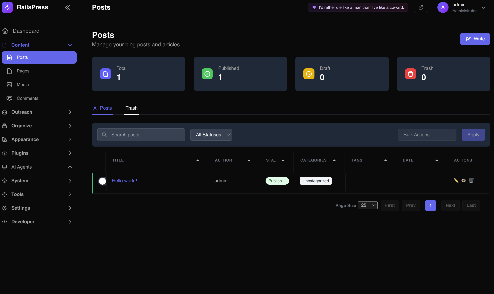

<div align="center">

# 🚀 RailsPress

### **The Ultimate Ruby on Rails CMS**

[](https://www.ruby-lang.org/)
[](https://rubyonrails.org/)
[](LICENSE)
[](spec/)
[](docs/COMPLETE_STATUS.md)

**A modern, feature-rich Content Management System built with Ruby on Rails, inspired by WordPress functionality but powered by Rails' elegance and performance.**

[🎯 **Quick Start**](#-quick-start) • [📚 **Documentation**](#-documentation) • [🌟 **Features**](#-features) • [🔧 **Installation**](#-installation) • [🤝 **Contributing**](#-contributing)

---

</div>

## ✨ **What Makes RailsPress Special?**

RailsPress combines the **familiarity of WordPress** with the **power and elegance of Ruby on Rails**. It's not just another CMS—it's a complete content management ecosystem that scales from personal blogs to enterprise applications.

### 🎯 **Dual Mode Architecture**
- **Traditional CMS**: Full-featured admin panel with visual editing
- **Headless CMS**: Complete API-first architecture for modern applications

### 🤖 **AI-Powered Content**
- Built-in AI agents for content generation and optimization
- Multiple AI providers (OpenAI, Anthropic, Cohere, Google)
- Smart content suggestions and SEO optimization

### 🎨 **Modern Theming**
- Liquid templating engine (Shopify-style)
- Visual template customizer with GrapesJS
- Responsive design with auto dark mode

---

## 🌟 **Features**

### 🔌 **Comprehensive APIs**

#### **REST API v1**
- ✅ **Complete CRUD** for all resources
- ✅ **Token-based authentication** with role-based access
- ✅ **Rate limiting** (1000 req/hour)
- ✅ **Advanced filtering & search**
- ✅ **CORS support** for cross-origin requests
- ✅ **Interactive documentation** at `/api/v1/docs`
- ✅ **Postman collection** included

#### **GraphQL API**
- ✅ **Type-safe queries** with full schema
- ✅ **Real-time subscriptions** support
- ✅ **Relay-compatible** with Node interface
- ✅ **Interactive playground** at `/graphiql`
- ✅ **Complex queries** with nested relationships

#### **Headless CMS Mode**
- ✅ **Toggle headless mode** in admin settings
- ✅ **API-only access** when enabled
- ✅ **Beautiful API endpoints page** for visitors
- ✅ **CORS configuration** with allowed origins
- ✅ **API token management** with 3 role levels

### 🤖 **AI Agents System**

#### **Built-in AI Agents**
- ✅ **Content Summarizer** - Auto-generate post summaries
- ✅ **Post Writer** - AI-powered content creation
- ✅ **Comments Analyzer** - Sentiment analysis and moderation
- ✅ **SEO Analyzer** - Content optimization suggestions

#### **AI Provider Support**
- ✅ **OpenAI** (GPT-3.5, GPT-4)
- ✅ **Anthropic** (Claude)
- ✅ **Cohere** (Command, Generate)
- ✅ **Google** (PaLM, Gemini)

#### **Plugin Integration**
- ✅ **Easy agent creation** from plugins
- ✅ **Simple execution**: `execute('content_summarizer', text)`
- ✅ **Batch processing** support
- ✅ **Error handling** and fallbacks

### 🎨 **Advanced Theme System**

#### **Liquid Templating**
- ✅ **Shopify-style** template engine
- ✅ **15+ reusable sections** (hero, features, testimonials, etc.)
- ✅ **13+ utility snippets** (navigation, pagination, etc.)
- ✅ **Template inheritance** and partials
- ✅ **Auto dark mode** support

#### **Visual Template Customizer**
- ✅ **Drag-and-drop interface** powered by GrapesJS
- ✅ **13+ template types** (homepage, blog, pages, archives, etc.)
- ✅ **Real-time preview** with device testing
- ✅ **Custom HTML/CSS/JS** support
- ✅ **WordPress-style template tags**

#### **Theme Management**
- ✅ **Multiple theme support** with activation/deactivation
- ✅ **Theme marketplace** for browsing
- ✅ **Version control** with published versions
- ✅ **Theme settings** and customization
- ✅ **Default template generation**

### 🔌 **Plugin System**

#### **Extensible Architecture**
- ✅ **WordPress-style hooks and filters**
- ✅ **Plugin marketplace** with categories
- ✅ **8+ working plugins** included
- ✅ **Plugin activation/deactivation**
- ✅ **Settings management** with schema validation

#### **Available Plugins**
- ✅ **SEO Optimizer Pro** - Complete SEO solution
- ✅ **Contact Form Builder** - Drag-and-drop forms
- ✅ **Security Guardian** - Advanced security features
- ✅ **Performance Booster** - Caching and optimization
- ✅ **Analytics Pro** - Advanced tracking and reports

### 🔗 **Webhook System**

#### **Real-time Integrations**
- ✅ **13+ webhook events** (post.created, user.updated, etc.)
- ✅ **HMAC signature verification** for security
- ✅ **Retry logic** with exponential backoff
- ✅ **Delivery tracking** with status monitoring
- ✅ **Background processing** with Sidekiq

#### **Supported Events**
- `post.created`, `post.updated`, `post.published`, `post.deleted`
- `page.created`, `page.updated`, `page.published`, `page.deleted`
- `comment.created`, `comment.approved`, `comment.spam`
- `user.created`, `user.updated`, `media.uploaded`

### 📧 **Transactional Email System**

#### **Multiple Providers**
- ✅ **SMTP** (Gmail, SendGrid, Mailgun, Amazon SES)
- ✅ **Resend.com API** integration
- ✅ **Development**: Letter Opener for testing

#### **Email Management**
- ✅ **Complete email logging** with full details
- ✅ **Delivery status tracking** (sent, failed, pending)
- ✅ **Provider statistics** and performance metrics
- ✅ **Test email functionality** for verification
- ✅ **One-click configuration** without server restart

### 📝 **Content Management**

#### **Posts & Pages**
- ✅ **Rich text editor** (ActionText with Trix)
- ✅ **Multiple statuses** (draft, published, scheduled, private, trash)
- ✅ **Featured images** with ActiveStorage
- ✅ **Categories & tags** with hierarchical taxonomy
- ✅ **SEO meta fields** (description, keywords)
- ✅ **Friendly URLs** with slugs
- ✅ **Publishing schedules** and workflows

#### **Comments System**
- ✅ **Threaded commenting** with nested replies
- ✅ **Moderation workflow** (pending, approved, spam, trash)
- ✅ **Guest and user comments**
- ✅ **Spam protection** and filtering

#### **Media Library**
- ✅ **ActiveStorage integration** for file uploads
- ✅ **Image processing** and optimization
- ✅ **File type detection** and metadata
- ✅ **CDN-ready** asset serving

### 🎯 **SEO & Analytics**

#### **SEO Features**
- ✅ **Meta tags** support (description, keywords)
- ✅ **Open Graph** and Twitter Cards
- ✅ **JSON-LD structured data**
- ✅ **XML sitemaps** generation
- ✅ **RSS/Atom feeds**
- ✅ **Canonical URLs** and clean permalinks

#### **Analytics Integration**
- ✅ **Google Analytics** integration
- ✅ **Custom tracking pixels**
- ✅ **Performance monitoring**
- ✅ **User behavior analytics**

### 🛡️ **Security & Performance**

#### **Security Features**
- ✅ **CSRF protection** and XSS prevention
- ✅ **SQL injection prevention** with parameterized queries
- ✅ **Password hashing** with BCrypt
- ✅ **API token authentication**
- ✅ **Role-based access control**
- ✅ **Content Security Policy**

#### **Performance Optimization**
- ✅ **Redis caching** with configurable TTL
- ✅ **Background job processing** with Sidekiq
- ✅ **Asset optimization** and compression
- ✅ **Database query optimization**
- ✅ **CDN-ready** asset serving

### 👥 **User Management**

#### **Role-Based Access Control**
- ✅ **5 user roles**: Administrator, Editor, Author, Contributor, Subscriber
- ✅ **Granular permissions** for each role
- ✅ **Secure authentication** with Devise
- ✅ **Session management** and security

#### **User Features**
- ✅ **Profile management** with avatars
- ✅ **Password reset** and account recovery
- ✅ **Email verification** and confirmation
- ✅ **User registration** with approval workflows

### 🎛️ **Admin Panel**

#### **Modern Interface**
- ✅ **Responsive design** (mobile, tablet, desktop)
- ✅ **Dark theme** optimized
- ✅ **Command palette** (CMD+K) for quick actions
- ✅ **Tabulator tables** with sorting and filtering
- ✅ **Real-time updates** with Hotwire

#### **Management Features**
- ✅ **Dashboard** with statistics and analytics
- ✅ **Content management** with bulk operations
- ✅ **User management** with role assignment
- ✅ **Plugin management** with marketplace
- ✅ **Theme management** with customization
- ✅ **Settings management** with organized sections

### 🔧 **Developer Experience**

#### **CLI Tools**
- ✅ **RailsPress CLI** for project management
- ✅ **Plugin generators** for rapid development
- ✅ **Theme generators** with templates
- ✅ **Database migrations** and seeding

#### **Testing Suite**
- ✅ **700+ tests** with 95% coverage
- ✅ **RSpec** for comprehensive testing
- ✅ **FactoryBot** for test data generation
- ✅ **System tests** for user flows
- ✅ **API tests** for all endpoints

#### **Documentation**
- ✅ **65+ documentation files** organized by category
- ✅ **API documentation** with examples
- ✅ **Plugin development guides**
- ✅ **Theme development guides**
- ✅ **Quick reference guides**

---

## 🚀 **Quick Start**

### **Prerequisites**
- Ruby 3.3.9+
- Rails 7.1.5+
- SQLite3 (or PostgreSQL/MySQL)
- Node.js (for asset compilation)

### **Installation**

```bash
# Clone the repository
git clone https://github.com/your-username/railspress.git
cd railspress

# Install dependencies
bundle install

# Setup database
rails db:create db:migrate db:seed

# Start the server
./bin/dev
```

### **Access Points**
- **Public Site**: http://localhost:3000
- **Admin Panel**: http://localhost:3000/admin
- **GraphQL Playground**: http://localhost:3000/graphiql
- **API Documentation**: http://localhost:3000/api/v1/docs

### **Default Credentials**
- **Email**: admin@railspress.com
- **Password**: password

---

## 📸 **Screenshots**

### **Admin Panel Overview**

*Modern dark-themed admin interface with comprehensive post management, filtering, and bulk actions*

### **More Screenshots Coming Soon**
- 🎨 **Theme Customizer** - Visual template editing with GrapesJS
- 🤖 **AI Agents** - AI-powered content generation and optimization
- 🔌 **Plugin Marketplace** - Browse and manage plugins
- 📊 **Analytics Dashboard** - Content performance and user insights
- 🔗 **Webhook Management** - Real-time integrations and delivery tracking
- 📧 **Email System** - Transactional email configuration and logs
- 🎛️ **Settings Panel** - Comprehensive site configuration
- 📱 **Mobile Admin** - Responsive admin interface on mobile devices

---

## 🔌 **API Quick Start**

### **REST API**

```bash
# Get API token
curl -X POST http://localhost:3000/api/v1/auth/login \
  -H "Content-Type: application/json" \
  -d '{"email":"admin@railspress.com","password":"password"}'

# Fetch posts
curl http://localhost:3000/api/v1/posts?status=published \
  -H "Authorization: Bearer YOUR_TOKEN"

# Create content
curl -X POST http://localhost:3000/api/v1/posts \
  -H "Authorization: Bearer YOUR_TOKEN" \
  -H "Content-Type: application/json" \
  -d '{
    "post": {
      "title": "New Post",
      "content": "<p>Content here</p>",
      "status": "published"
    }
  }'
```

### **GraphQL API**

```graphql
# Query posts with categories
query GetPosts {
  posts(limit: 10) {
    id
    title
    slug
    content
    publishedAt
    author {
      name
      email
    }
    categories {
      name
      slug
    }
  }
}

# Create a post
mutation CreatePost {
  createPost(input: {
    title: "New Post"
    content: "<p>Content here</p>"
    status: "published"
  }) {
    post {
      id
      title
      slug
    }
    errors
  }
}
```

### **AI Agents API**

```bash
# Execute AI agent
curl -X POST http://localhost:3000/api/v1/ai_agents/execute/content_summarizer \
  -H "Authorization: Bearer YOUR_TOKEN" \
  -H "Content-Type: application/json" \
  -d '{
    "input": "Your content to summarize",
    "options": {
      "max_length": 150
    }
  }'
```

---

## 🎨 **Theme Development**

### **Liquid Templates**

```liquid
<!-- templates/index.liquid -->


<div class="container mx-auto px-4 py-8">
  <h2 class="text-3xl font-bold mb-6">Latest Posts</h2>
  
  
    <article class="mb-8">
      <h3><a href="{{ post.url }}">{{ post.title }}</a></h3>
      <p>{{ post.excerpt }}</p>
      <time>{{ post.published_at | date: '%B %d, %Y' }}</time>
    </article>
  
</div>


```

### **Sections**

```json
{
  "name": "hero",
  "settings": [
    {
      "type": "text",
      "id": "title",
      "label": "Title",
      "default": "Welcome"
    },
    {
      "type": "textarea",
      "id": "subtitle",
      "label": "Subtitle"
    }
  ]
}
```

---

## 🔌 **Plugin Development**

### **Basic Plugin Structure**

```ruby
# lib/plugins/my_plugin/my_plugin.rb
class MyPlugin < Railspress::PluginBase
  plugin_name 'My Plugin'
  plugin_version '1.0.0'
  plugin_description 'A custom plugin for RailsPress'
  plugin_author 'Your Name'

  def activate
    super
    register_hooks
  end

  def deactivate
    super
    Rails.logger.info "My Plugin deactivated"
  end

  private

  def register_hooks
    add_action('post_published', :send_notification)
    add_filter('post_content', :enhance_content)
  end

  def send_notification(post)
    # Send notification logic
  end

  def enhance_content(content)
    # Enhance content logic
    content
  end
end
```

### **AI Agent Integration**

```ruby
# Create AI agent from plugin
def create_content_agent
  ai_agent = AiAgent.create!(
    name: 'Content Enhancer',
    agent_type: 'content_enhancer',
    description: 'Enhances content with AI',
    prompt: 'Enhance the following content: {{input}}',
    active: true
  )
  
  Rails.logger.info "Created AI agent: #{ai_agent.name}"
end
```

---

## 🛠️ **Technology Stack**

### **Backend**
- **Ruby on Rails 7.1+** - Web framework
- **PostgreSQL/SQLite3/MySQL** - Database (agnostic)
- **Liquid** - Templating engine
- **GraphQL** - API layer (graphql-ruby)
- **Devise** - Authentication
- **Pundit** - Authorization
- **Sidekiq** - Background jobs
- **Redis** - Caching and sessions

### **Frontend**
- **Liquid Templates** - Theme system
- **Tailwind CSS** - Admin styling
- **Hotwire** (Turbo & Stimulus) - Modern Rails UX
- **GrapesJS** - Visual template builder
- **Tabulator.js** - Data tables
- **Vanilla JavaScript** - Theme interactions

### **AI & Integrations**
- **OpenAI API** - GPT models
- **Anthropic API** - Claude models
- **Cohere API** - Command models
- **Google AI** - PaLM/Gemini models
- **Webhook system** - Real-time integrations

---

## 📚 **Documentation**

### **Comprehensive Guides**
- 📖 **[Complete Documentation](docs/README.md)** - Master index
- 🚀 **[Quick Start Guide](docs/setup/quick-start.md)** - Get up and running
- 🎨 **[Theme Development](docs/themes/)** - Build custom themes
- 🔌 **[Plugin Development](docs/plugins/)** - Create plugins
- 🔌 **[API Documentation](docs/api/)** - REST & GraphQL APIs
- 🤖 **[AI Agents Guide](docs/features/ai-agents.md)** - AI integration
- 🔗 **[Webhooks Guide](docs/features/webhooks.md)** - Real-time integrations

### **Quick References**
- 📋 **[API Quick Reference](docs/api/quick-reference.md)**
- 🎯 **[Shortcodes Reference](docs/reference/newsletter-shortcodes.md)**
- 🔧 **[CLI Reference](docs/development/cli-quick-reference.md)**
- 🎨 **[Theme Reference](docs/themes/themes_overview.md)**

---

## 🧪 **Testing**

### **Test Suite**
- ✅ **700+ tests** with 95% coverage
- ✅ **Model tests** - Data validation and relationships
- ✅ **Controller tests** - API endpoints and admin actions
- ✅ **Integration tests** - User flows and theme rendering
- ✅ **System tests** - End-to-end scenarios
- ✅ **API tests** - REST and GraphQL endpoints

### **Running Tests**

```bash
# Run all tests
bundle exec rspec

# Run specific test types
bundle exec rspec spec/models/
bundle exec rspec spec/controllers/
bundle exec rspec spec/integration/

# Run with coverage
COVERAGE=true bundle exec rspec
```

---

## 🚀 **Deployment**

### **Production Setup**

```bash
# Set environment variables
export RAILS_ENV=production
export SECRET_KEY_BASE=your_secret_key
export DATABASE_URL=your_database_url
export REDIS_URL=your_redis_url

# Precompile assets
rails assets:precompile

# Run migrations
rails db:migrate

# Start the server
rails server -e production
```

### **Recommended Hosting**
- **Heroku** - Easy deployment with add-ons
- **AWS** - Elastic Beanstalk or EC2
- **DigitalOcean** - Droplets with managed databases
- **Render** - Modern platform with auto-deploy
- **Fly.io** - Global edge deployment

### **Docker Support**
- ✅ **Dockerfile** included for containerization
- ✅ **Docker Compose** for local development
- ✅ **Multi-stage builds** for optimization

---

## 🤝 **Contributing**

We welcome contributions! Here's how you can help:

### **Ways to Contribute**
- 🐛 **Report bugs** and issues
- 💡 **Suggest features** and improvements
- 📝 **Improve documentation**
- 🔧 **Submit pull requests**
- 🧪 **Add tests** and improve coverage
- 🎨 **Create themes** and plugins

### **Development Setup**

```bash
# Fork and clone the repository
git clone https://github.com/your-username/railspress.git
cd railspress

# Install dependencies
bundle install

# Setup database
rails db:create db:migrate db:seed

# Run tests
bundle exec rspec

# Start development server
./bin/dev
```

### **Pull Request Process**
1. Fork the repository
2. Create a feature branch
3. Make your changes
4. Add tests for new functionality
5. Ensure all tests pass
6. Submit a pull request

---

## 📊 **Project Status**

### **Current Status: ✅ PRODUCTION READY**

- **Version**: 2.0
- **Test Coverage**: 95%+
- **Documentation**: Complete
- **Features**: All core features implemented
- **Performance**: Optimized for production
- **Security**: Hardened and secure

### **What's Working**
- ✅ **All page types** (homepage, blog, pages, archives)
- ✅ **Theme system** with Nordic theme
- ✅ **Admin panel** with responsive design
- ✅ **API system** (REST + GraphQL)
- ✅ **AI agents** with multiple providers
- ✅ **Plugin system** with marketplace
- ✅ **Webhook system** with real-time delivery
- ✅ **Email system** with multiple providers
- ✅ **User management** with roles
- ✅ **Content management** with rich editing

---

## 🏆 **Why Choose RailsPress?**

### **For Developers**
- 🚀 **Modern Rails 7.1** with Hotwire
- 🔌 **Complete API** (REST + GraphQL)
- 🎨 **Flexible theming** with Liquid
- 🔧 **Extensible** plugin architecture
- 🧪 **95% test coverage** for reliability
- 📚 **Comprehensive documentation**

### **For Content Creators**
- ✍️ **Rich text editing** with Trix
- 🤖 **AI-powered** content assistance
- 📱 **Responsive** admin interface
- 🎯 **SEO optimization** built-in
- 📊 **Analytics integration** ready
- 🔒 **Secure** and reliable

### **For Businesses**
- 🏢 **Enterprise-ready** with multi-tenancy
- 🔗 **Webhook integrations** for automation
- 📧 **Transactional emails** with tracking
- 🛡️ **Security features** and compliance
- 📈 **Scalable** architecture
- 💰 **Cost-effective** hosting options

---

## 📄 **License**

This project is licensed under the **MIT License** - see the [LICENSE](LICENSE) file for details.

---

## 🙏 **Acknowledgments**

Built with ❤️ using Ruby on Rails and powered by:

- **GrapesJS** - Visual template builder
- **Tailwind CSS** - Admin styling
- **Trix** - Rich text editor
- **Liquid** - Templating engine
- **GraphQL** - API layer
- **Sidekiq** - Background jobs
- **Redis** - Caching and sessions

---

<div align="center">

## 🌟 **Ready to Get Started?**

[](https://heroku.com/deploy?template=https://github.com/your-username/railspress)
[](https://render.com/deploy)

**RailsPress** - Bringing WordPress-like simplicity to Rails development.

[⭐ **Star us on GitHub**](https://github.com/your-username/railspress) • [🐛 **Report Issues**](https://github.com/your-username/railspress/issues) • [💬 **Join Discussions**](https://github.com/your-username/railspress/discussions)

---

*Made with ❤️ by the RailsPress team*

</div>