<div align="center">

# 🚀 RailsPress

### **The Ultimate Ruby on Rails CMS**

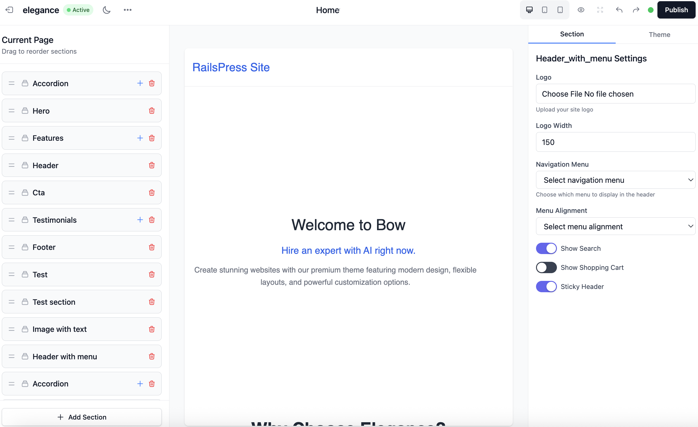

[](https://www.ruby-lang.org/)
[](https://rubyonrails.org/)
[](LICENSE)
[](spec/)
[](docs/COMPLETE_STATUS.md)

**A modern, feature-rich Content Management System built with Ruby on Rails, inspired by WordPress functionality but powered by Rails' elegance and performance.**

[🎯 **Quick Start**](#-quick-start) • [📚 **Documentation**](#-documentation) • [🌟 **Features**](#-features) • [🔧 **Installation**](#-installation) • [🤝 **Contributing**](#-contributing)

---

</div>

## ✨ **What Makes RailsPress Special?**

RailsPress combines the **familiarity of WordPress** with the **power and elegance of Ruby on Rails**. It's not just another CMS—it's a complete content management ecosystem that scales from personal blogs to enterprise applications.

### 🎯 **Dual Mode Architecture**
- **Traditional CMS**: Full-featured admin panel with visual editing
- **Headless CMS**: Complete API-first architecture for modern applications

### 🤖 **AI-Powered Content**
- Built-in AI agents for content generation and optimization
- Multiple AI providers (OpenAI, Anthropic, Cohere, Google)
- Smart content suggestions and SEO optimization

### 🎨 **Modern Theming**
- Liquid templating engine (Shopify-style)
- Custom visual builder system (replaced GrapesJS)
- Responsive design with auto dark mode
- Advanced theme versioning and rollback

## 🆕 **Major Updates & New Features**

### **🔒 GDPR Compliance System**
RailsPress now includes a comprehensive GDPR compliance system that rivals enterprise solutions:

- **Complete Data Subject Rights** - All 8 GDPR rights implemented
- **Admin Interface** - Full compliance management at `/admin/gdpr`
- **Data Export/Import** - Machine-readable JSON exports
- **Data Erasure** - Complete data deletion with audit trails
- **Privacy by Design** - Built-in privacy protection

### **🍪 Enterprise Consent Management**
OneTrust-level consent management system with advanced features:

- **Geolocation-Based Rules** - Automatic region detection (EU, US, UK, Canada)
- **Pixel Management** - Consent-aware loading for 15+ tracking pixels
- **Customizable Banner** - Themes, colors, and positioning options
- **Liquid Integration** - Seamless template integration with ``
- **Admin Dashboard** - Complete consent analytics and management

### **🤖 Model Context Protocol (MCP)**
OpenAI 3.1 compatible MCP server for AI model integration:

- **JSON-RPC 2.0 Protocol** - Full specification compliance
- **Tool Management** - Comprehensive tool schemas and execution
- **Resource Access** - Content browsing and management
- **Prompt Templates** - AI interaction templates
- **Admin Settings** - Complete configuration interface
- **Rate Limiting** - Security and performance controls

### **📊 GDPR-Compliant Analytics System**
Privacy-first analytics that rivals Plausible and Fathom:

- **Privacy-First Design** - No personal data, IP anonymization, consent management
- **Real-Time Analytics** - Live visitor tracking with active visitor count
- **GDPR Compliance** - Full compliance with data subject rights
- **Bot Detection** - Automatically filters out automated traffic
- **Data Anonymization** - Auto-anonymize old data (90+ days)
- **Consent Management** - Cookie consent banner with opt-out
- **CSV Export** - Data portability for user rights
- **Multi-Tenant** - Isolated analytics per tenant

---

---

---

### 🔌 **Comprehensive APIs**

#### **REST API v1**
- ✅ **Complete CRUD** for all resources
- ✅ **Token-based authentication** with role-based access
- ✅ **Rate limiting** (1000 req/hour)
- ✅ **Advanced filtering & search**
- ✅ **CORS support** for cross-origin requests
- ✅ **Interactive documentation** at `/api/v1/docs`
- ✅ **Postman collection** included

#### **GraphQL API**
- ✅ **Type-safe queries** with full schema
- ✅ **Real-time subscriptions** support
- ✅ **Relay-compatible** with Node interface
- ✅ **Interactive playground** at `/graphiql`
- ✅ **Complex queries** with nested relationships

#### **Headless CMS Mode**
- ✅ **Toggle headless mode** in admin settings
- ✅ **API-only access** when enabled
- ✅ **Beautiful API endpoints page** for visitors
- ✅ **CORS configuration** with allowed origins
- ✅ **API token management** with 3 role levels

### 🤖 **AI Agents System**

#### **Built-in AI Agents**
- ✅ **Content Summarizer** - Auto-generate post summaries
- ✅ **Post Writer** - AI-powered content creation
- ✅ **Comments Analyzer** - Sentiment analysis and moderation
- ✅ **SEO Analyzer** - Content optimization suggestions

#### **AI Provider Support**
- ✅ **OpenAI** (GPT-3.5, GPT-4)
- ✅ **Anthropic** (Claude)
- ✅ **Cohere** (Command, Generate)
- ✅ **Google** (PaLM, Gemini)

#### **Plugin Integration**
- ✅ **Easy agent creation** from plugins
- ✅ **Simple execution**: `execute('content_summarizer', text)`
- ✅ **Batch processing** support
- ✅ **Error handling** and fallbacks

### 🎨 **Advanced Theme System**

#### **Liquid Templating**
- ✅ **Shopify-style** template engine
- ✅ **15+ reusable sections** (hero, features, testimonials, etc.)
- ✅ **13+ utility snippets** (navigation, pagination, etc.)
- ✅ **Template inheritance** and partials
- ✅ **Auto dark mode** support

#### **Custom Visual Builder System**
- ✅ **Native drag-and-drop interface** (replaced GrapesJS)
- ✅ **13+ template types** (homepage, blog, pages, archives, etc.)
- ✅ **Real-time preview** with device testing
- ✅ **Advanced section management** with live editing
- ✅ **Theme versioning** with rollback capabilities
- ✅ **Custom HTML/CSS/JS** support
- ✅ **WordPress-style template tags**

#### **Theme Management**
- ✅ **Multiple theme support** with activation/deactivation
- ✅ **Theme marketplace** for browsing
- ✅ **Version control** with published versions
- ✅ **Theme settings** and customization
- ✅ **Default template generation**

### 🔌 **Plugin System**

#### **Extensible Architecture**
- ✅ **WordPress-style hooks and filters**
- ✅ **Plugin marketplace** with categories
- ✅ **8+ working plugins** included
- ✅ **Plugin activation/deactivation**
- ✅ **Settings management** with schema validation

#### **Available Plugins**
- ✅ **SEO Optimizer Pro** - Complete SEO solution
- ✅ **Contact Form Builder** - Drag-and-drop forms
- ✅ **Security Guardian** - Advanced security features
- ✅ **Performance Booster** - Caching and optimization
- ✅ **Analytics Pro** - Advanced tracking and reports

### 🔒 **GDPR Compliance System**

#### **Complete Privacy Compliance**
- ✅ **Full GDPR compliance** with all data subject rights
- ✅ **Data export functionality** (Article 20 - Right to Data Portability)
- ✅ **Data erasure system** (Article 17 - Right to be Forgotten)
- ✅ **Consent management** (Article 7 - Consent)
- ✅ **Privacy by design** architecture (Article 25)
- ✅ **Audit trails** for all data processing activities
- ✅ **Admin interface** for compliance management

#### **Data Subject Rights Implementation**
- ✅ **Right to be Informed** - Comprehensive privacy notices
- ✅ **Right of Access** - Complete data export functionality
- ✅ **Right to Rectification** - Data correction mechanisms
- ✅ **Right to Erasure** - Full data deletion capabilities
- ✅ **Right to Restrict Processing** - Processing controls
- ✅ **Right to Data Portability** - Machine-readable exports
- ✅ **Right to Object** - Processing objection handling
- ✅ **Automated Decision Rights** - Human oversight controls

### 🍪 **Consent Management System**

#### **Enterprise-Grade Consent Management**
- ✅ **OneTrust-level functionality** with comprehensive features
- ✅ **GDPR/CCPA compliance** with region-specific rules
- ✅ **Geolocation-based consent** with automatic region detection
- ✅ **Pixel management** with consent-aware loading
- ✅ **Customizable consent banner** with themes and colors
- ✅ **Liquid template integration** for seamless implementation
- ✅ **Admin interface** for complete consent management
- ✅ **API endpoints** for programmatic consent handling

#### **Consent Categories & Features**
- ✅ **Necessary Cookies** (always required)
- ✅ **Analytics Cookies** (Google Analytics, Clarity, Hotjar)
- ✅ **Marketing Cookies** (Facebook, TikTok, LinkedIn, Twitter, Pinterest, Snapchat, Reddit)
- ✅ **Functional Cookies** (Mixpanel, Segment, Heap)
- ✅ **Granular consent controls** with individual category management
- ✅ **Consent analytics** and compliance reporting
- ✅ **Consent withdrawal** and modification capabilities

### 📊 **GDPR-Compliant Analytics System**

#### **Privacy-First Analytics**
- ✅ **GDPR compliant** with no personal data collection
- ✅ **Real-time analytics** with live visitor tracking
- ✅ **IP anonymization** using SHA-256 + salt (first 16 chars only)
- ✅ **Consent management** with cookie consent banner
- ✅ **Bot detection** to filter out automated traffic
- ✅ **Data anonymization** for old data (90+ days)
- ✅ **CSV export** for data portability
- ✅ **Multi-tenant** isolated analytics per tenant

#### **Analytics Features**
- ✅ **Pageview tracking** with referrer information
- ✅ **Geographic data** (country-level only, no city tracking)
- ✅ **Device & browser stats** (desktop/mobile/tablet breakdown)
- ✅ **Time on page** and engagement metrics
- ✅ **Top content** analysis (most viewed posts and pages)
- ✅ **Referrer tracking** to know traffic sources
- ✅ **Hourly distribution** and daily trends
- ✅ **Bounce rate** and returning visitor analysis

#### **Privacy Protection**
- ✅ **No personal data** (emails, names, precise location)
- ✅ **No cross-site tracking** or fingerprinting
- ✅ **No persistent IDs** without consent
- ✅ **Consent-based tracking** only
- ✅ **Auto-deletion** of non-consented data (30+ days)
- ✅ **Data minimization** principles
- ✅ **User rights** implementation (access, erasure, portability)

---

#### **Notion-Style Editor**
- ✅ **Full-screen writing mode** with minimal interface
- ✅ **Editor.js integration** for block-based content creation
- ✅ **15+ block types** (headers, lists, quotes, code, images, tables)
- ✅ **Auto-save functionality** as you type
- ✅ **Keyboard shortcuts** for power users
- ✅ **Clean JSON output** perfect for APIs
- ✅ **Dark mode support** with automatic detection
- ✅ **Media support** (images, files, YouTube, Vimeo embeds)
- ✅ **Inline formatting** (bold, italic, underline, code, highlight)

#### **Writing Features**
- ✅ **Large title input** (40px font, bold weight)
- ✅ **Clean canvas** with centered 700px max-width
- ✅ **Sticky toolbar** with glassmorphism effect
- ✅ **Floating save indicator** with green confirmation
- ✅ **Status badges** (Draft/Published) with minimal design
- ✅ **Real-time collaboration** ready
- ✅ **Mobile-responsive** writing interface
- ✅ **Accessibility features** built-in

---

#### **Multi-Platform Content Distribution**
- ✅ **Device-specific channels** (Web, Mobile, Tablet, Smart TV, Email)
- ✅ **Automatic channel detection** based on user agent
- ✅ **Content overrides** for channel-specific customization
- ✅ **Channel exclusions** to hide content from specific channels
- ✅ **Multi-domain support** with locale management
- ✅ **AI-powered content optimization** for each channel
- ✅ **GraphQL API** for channel management
- ✅ **Admin interface** for complete channel control

#### **Channel Types & Features**
- ✅ **Web Channel** - Desktop and standard web content
- ✅ **Mobile Channel** - Mobile-optimized content and layouts
- ✅ **Tablet Channel** - Tablet-specific content adaptations
- ✅ **Smart TV Channel** - TV-optimized content for streaming devices
- ✅ **Newsletter Channel** - Email-specific content formatting
- ✅ **Custom Channels** - User-defined channels for specific platforms
- ✅ **Channel Overrides** - Granular content customization per channel
- ✅ **Content Exclusions** - Hide specific content from channels
- ✅ **Multi-locale Support** - Language-specific channel configurations

---

#### **AI Integration Platform**
- ✅ **OpenAI 3.1 compatible** MCP server implementation
- ✅ **JSON-RPC 2.0 protocol** with full specification support
- ✅ **Complete API endpoints** for AI model integration
- ✅ **Tool management** with comprehensive schemas
- ✅ **Resource access** for content management
- ✅ **Prompt templates** for AI interactions
- ✅ **Admin settings interface** for configuration
- ✅ **Rate limiting** and security controls

#### **MCP Capabilities**
- ✅ **Session management** with handshake protocol
- ✅ **Tool execution** with parameter validation
- ✅ **Resource browsing** and content access
- ✅ **Prompt execution** with template support
- ✅ **Real-time streaming** with Server-Sent Events
- ✅ **Authentication** with API key management
- ✅ **Comprehensive documentation** and testing guides

---

#### **Real-time Integrations**
- ✅ **13+ webhook events** (post.created, user.updated, etc.)
- ✅ **HMAC signature verification** for security
- ✅ **Retry logic** with exponential backoff
- ✅ **Delivery tracking** with status monitoring
- ✅ **Background processing** with Sidekiq

#### **Supported Events**
- `post.created`, `post.updated`, `post.published`, `post.deleted`
- `page.created`, `page.updated`, `page.published`, `page.deleted`
- `comment.created`, `comment.approved`, `comment.spam`
- `user.created`, `user.updated`, `media.uploaded`

### 📧 **Transactional Email System**

#### **Multiple Providers**
- ✅ **SMTP** (Gmail, SendGrid, Mailgun, Amazon SES)
- ✅ **Resend.com API** integration
- ✅ **Development**: Letter Opener for testing

#### **Email Management**
- ✅ **Complete email logging** with full details
- ✅ **Delivery status tracking** (sent, failed, pending)
- ✅ **Provider statistics** and performance metrics
- ✅ **Test email functionality** for verification
- ✅ **One-click configuration** without server restart

### 📝 **Content Management**

#### **Posts & Pages**
- ✅ **Rich text editor** (ActionText with Trix)
- ✅ **Multiple statuses** (draft, published, scheduled, private, trash)
- ✅ **Featured images** with ActiveStorage
- ✅ **Categories & tags** with hierarchical taxonomy
- ✅ **SEO meta fields** (description, keywords)
- ✅ **Friendly URLs** with slugs
- ✅ **Publishing schedules** and workflows

#### **Comments System**
- ✅ **Threaded commenting** with nested replies
- ✅ **Moderation workflow** (pending, approved, spam, trash)
- ✅ **Guest and user comments**
- ✅ **Spam protection** and filtering

#### **Media Library**
- ✅ **ActiveStorage integration** for file uploads
- ✅ **Image processing** and optimization
- ✅ **File type detection** and metadata
- ✅ **CDN-ready** asset serving

### 🎯 **SEO & Analytics**

#### **SEO Features**
- ✅ **Meta tags** support (description, keywords)
- ✅ **Open Graph** and Twitter Cards
- ✅ **JSON-LD structured data**
- ✅ **XML sitemaps** generation
- ✅ **RSS/Atom feeds**
- ✅ **Canonical URLs** and clean permalinks

#### **Analytics Integration**
- ✅ **Google Analytics** integration
- ✅ **Custom tracking pixels**
- ✅ **Performance monitoring**
- ✅ **User behavior analytics**

### 🛡️ **Security & Performance**

#### **Security Features**
- ✅ **CSRF protection** and XSS prevention
- ✅ **SQL injection prevention** with parameterized queries
- ✅ **Password hashing** with BCrypt
- ✅ **API token authentication**
- ✅ **Role-based access control**
- ✅ **Content Security Policy**

#### **Performance Optimization**
- ✅ **Redis caching** with configurable TTL
- ✅ **Background job processing** with Sidekiq
- ✅ **Asset optimization** and compression
- ✅ **Database query optimization**
- ✅ **CDN-ready** asset serving

### 👥 **User Management**

#### **Role-Based Access Control**
- ✅ **5 user roles**: Administrator, Editor, Author, Contributor, Subscriber
- ✅ **Granular permissions** for each role
- ✅ **Secure authentication** with Devise
- ✅ **Session management** and security

#### **User Features**
- ✅ **Profile management** with avatars
- ✅ **Password reset** and account recovery
- ✅ **Email verification** and confirmation
- ✅ **User registration** with approval workflows

### 🎛️ **Admin Panel**

#### **Modern Interface**
- ✅ **Responsive design** (mobile, tablet, desktop)
- ✅ **Dark theme** optimized
- ✅ **Command palette** (CMD+K) for quick actions
- ✅ **Tabulator tables** with sorting and filtering
- ✅ **Real-time updates** with Hotwire

#### **Management Features**
- ✅ **Dashboard** with statistics and analytics
- ✅ **Content management** with bulk operations
- ✅ **User management** with role assignment
- ✅ **Plugin management** with marketplace
- ✅ **Theme management** with customization
- ✅ **Settings management** with organized sections

### 🔧 **Developer Experience**

#### **CLI Tools**
- ✅ **RailsPress CLI** for project management
- ✅ **Plugin generators** for rapid development
- ✅ **Theme generators** with templates
- ✅ **Database migrations** and seeding

#### **Testing Suite**
- ✅ **700+ tests** with 95% coverage
- ✅ **RSpec** for comprehensive testing
- ✅ **FactoryBot** for test data generation
- ✅ **System tests** for user flows
- ✅ **API tests** for all endpoints

#### **Documentation**
- ✅ **65+ documentation files** organized by category
- ✅ **API documentation** with examples
- ✅ **Plugin development guides**
- ✅ **Theme development guides**
- ✅ **Quick reference guides**

---

## 🚀 **Quick Start**

### **Prerequisites**
- Ruby 3.3.9+
- Rails 7.1.5+
- SQLite3 (or PostgreSQL/MySQL)
- Node.js (for asset compilation)

### **Installation**

```bash
# Clone the repository
git clone https://github.com/your-username/railspress.git
cd railspress

# Install dependencies
bundle install

# Setup database
rails db:create db:migrate db:seed

# Start the server
./bin/dev
```

### **Access Points**
- **Public Site**: http://localhost:3000
- **Admin Panel**: http://localhost:3000/admin
- **GraphQL Playground**: http://localhost:3000/graphiql
- **API Documentation**: http://localhost:3000/api/v1/docs

### **Default Credentials**
- **Email**: admin@railspress.com
- **Password**: password

---

## 📺 **Content Channels System**

Deliver optimized content per device and medium using out-of-the-box channels and per-resource overrides.

### **Default Channels**
- **Web (`web`)**: Desktop/laptop optimized, large layout, high-quality images, sidebar/nav visible
- **Mobile (`mobile`)**: Touch-first UI, hamburger navigation, infinite scroll, compressed images
- **Newsletter (`newsletter`)**: Email-optimized 600px width, no animations, simplified layout

Each channel has its own `settings` (layout, pagination, image quality, navigation, features) and `metadata` (device type, user agent hints, performance target). You can add overrides per post/page/media and exclude content by channel. Admin UI at `Admin → System → Channels`.

GraphQL and REST expose channel-aware content; server auto-detects device or you can force a channel via slug.

### **Overrides & Exclusions**
- **Overrides (kind: `override`)**: Change any JSON field for a specific resource on a specific channel using a dot-path (e.g., `seo.title`, `content.hero.heading`).
- **Exclusions (kind: `exclude`)**: Hide a resource from a specific channel (e.g., exclude a post from `newsletter`).
- **Admin**: `Admin → System → Channels → [Channel] → Overrides`
  - Create/edit overrides with: `resource_type`, `resource_id`, `kind`, `path`, `data`, `enabled`
  - Bulk actions: copy overrides from another channel; export (JSON/YAML); import (JSON/YAML)
- **Runtime behavior**:
  - Overrides are merged into the rendered JSON payload for that channel only
  - Exclusions short-circuit visibility for that `(resource, channel)` pair
  - Optional provenance tracking is supported when applying overrides (for debugging/audits)

---

## 🎨 **Built-in Themes (Default)**

RailsPress ships with three production-ready themes:

- **Nordic**: Minimal, content-focused blog/news theme
- **TwentyTwentyFive**: Modern, general-purpose theme with rich sections
- **Elegance**: Polished marketing theme with hero, features, testimonials, CTA

Switch themes in `Admin → Themes`. Files live under `app/themes/`. Theme versions are tracked with rollback and a visual builder for section-based editing.

---

## 📸 **Screenshots**

### **Admin Interface**

#### **Dashboard & Management**
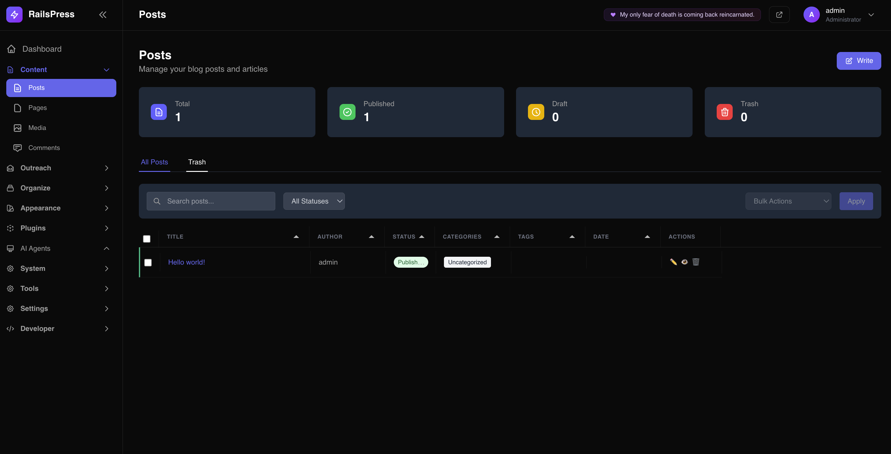

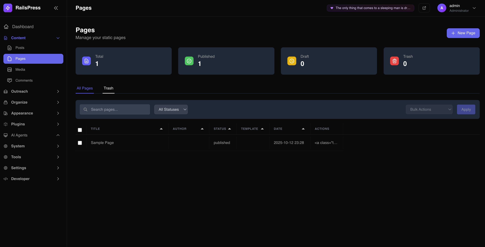

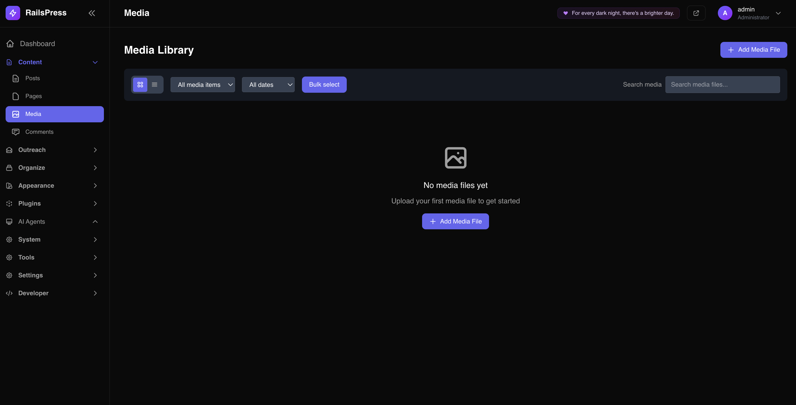

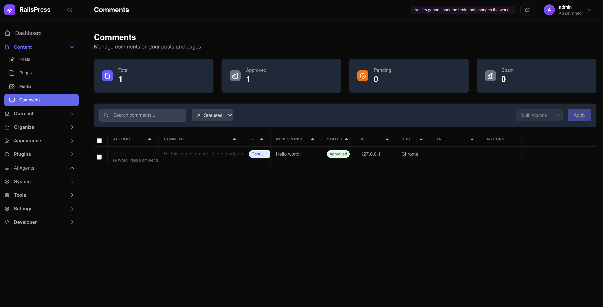

#### **Theme & Customization**
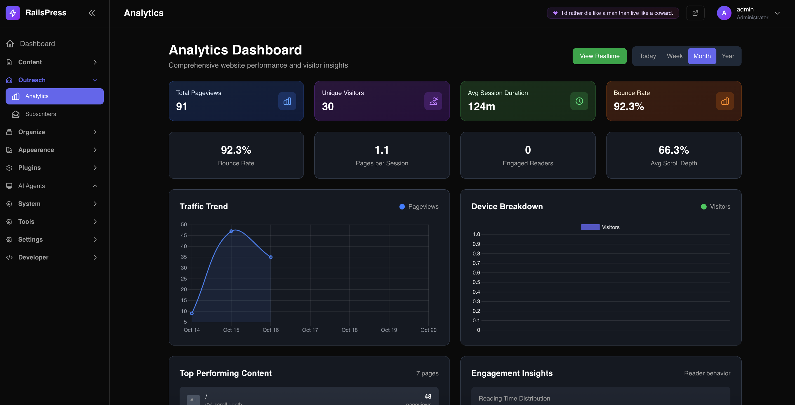


#### **Advanced Features**
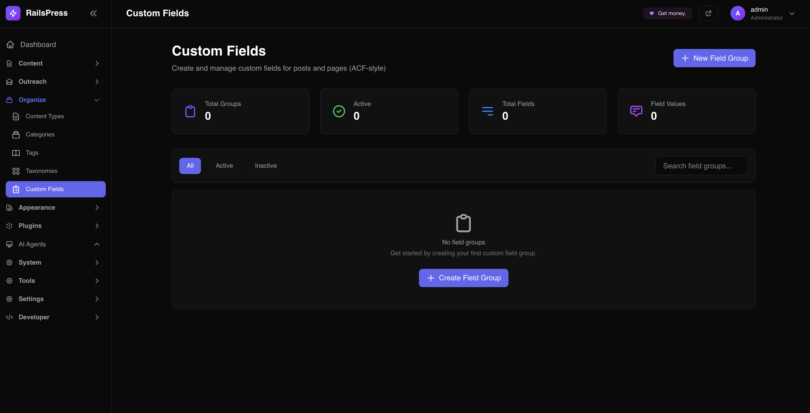

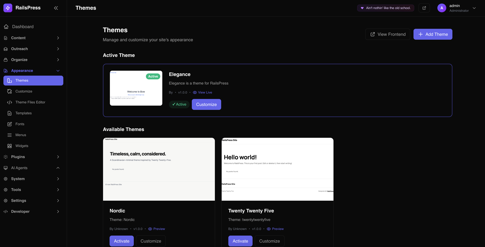

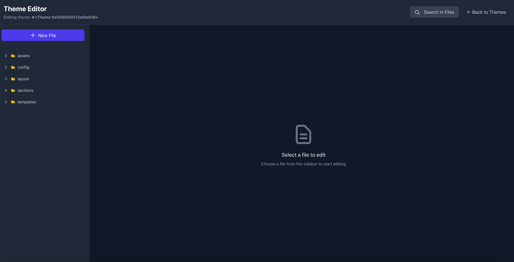

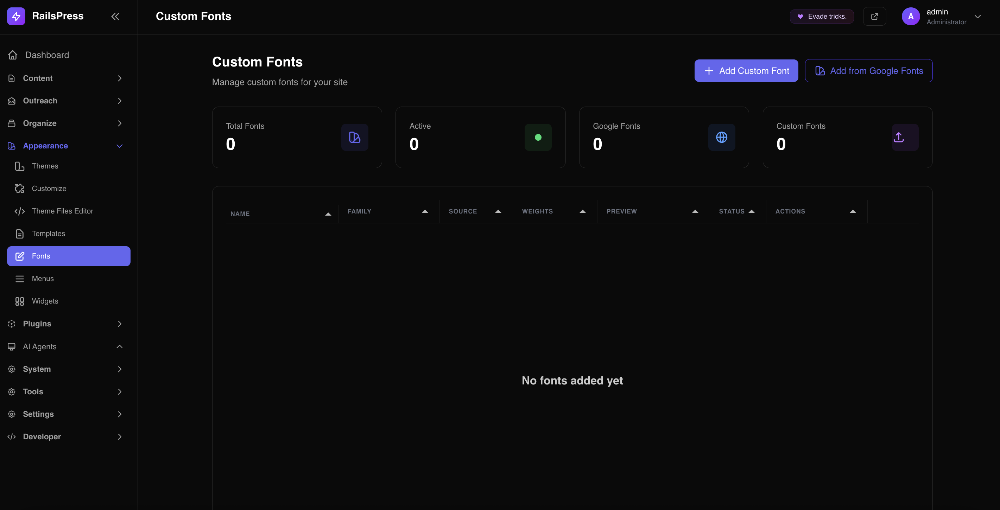

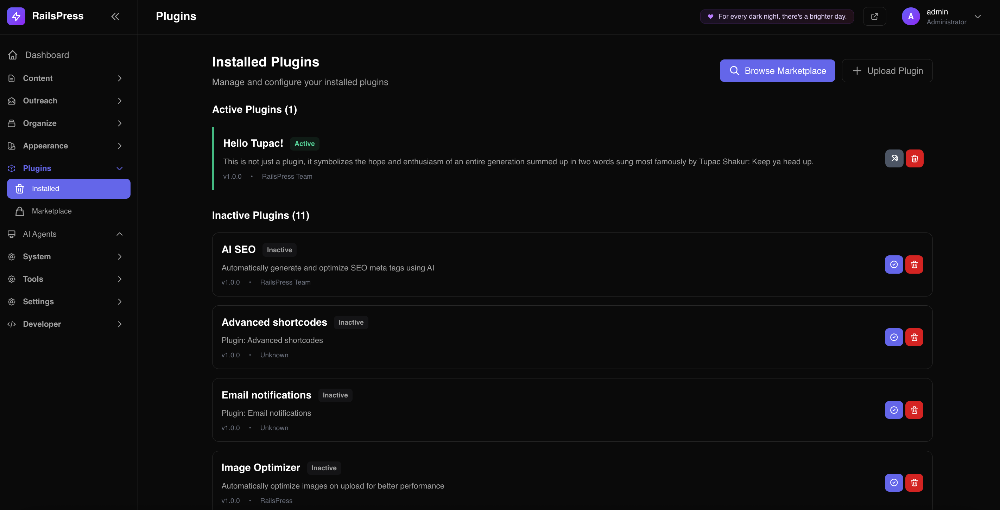

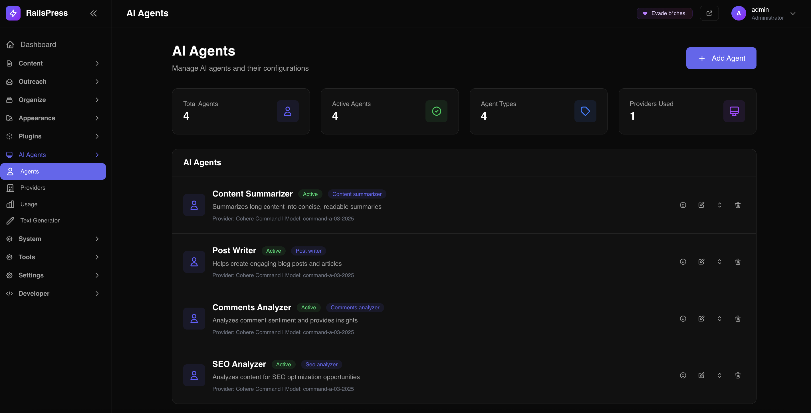

#### **System Management**
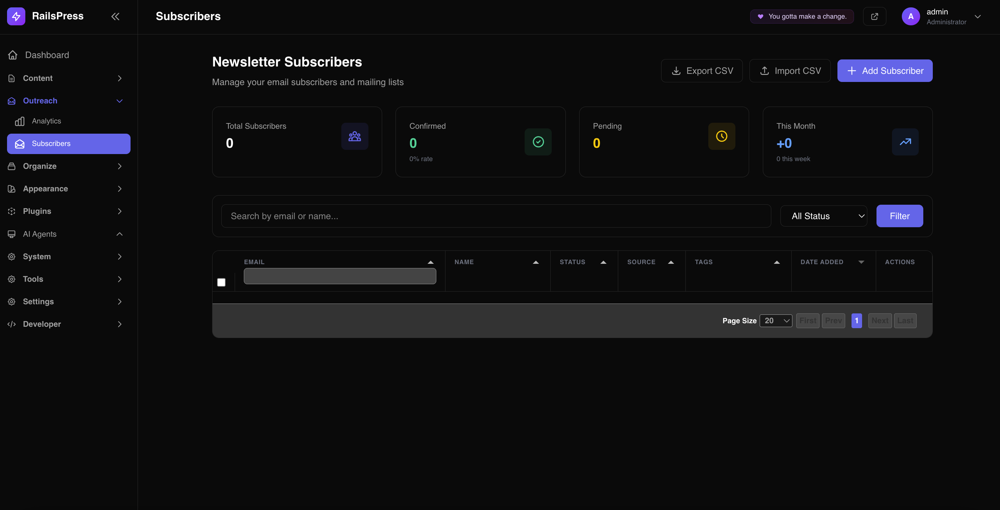

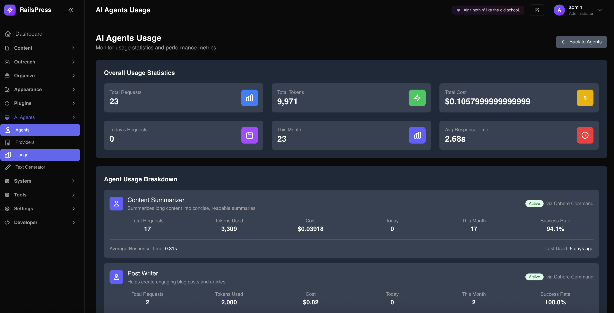

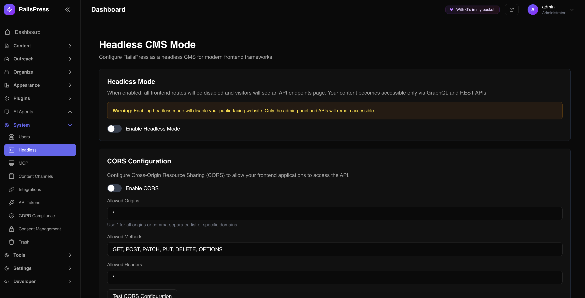

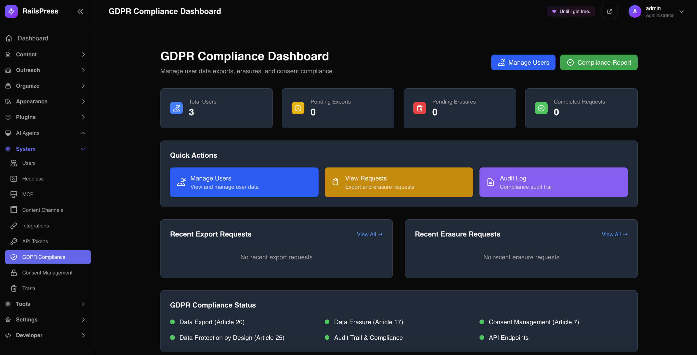

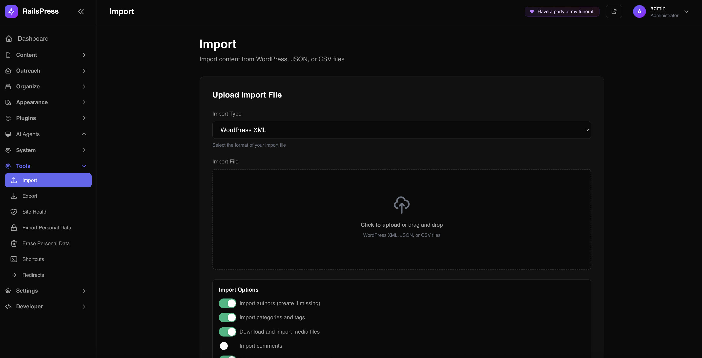

### **Frontend Experience**

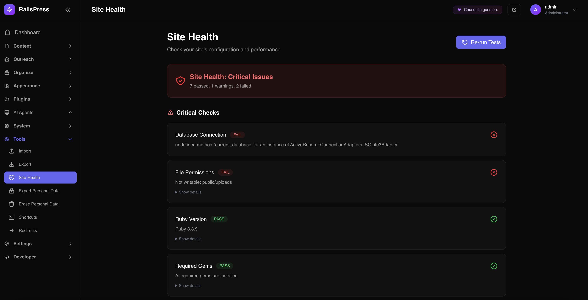

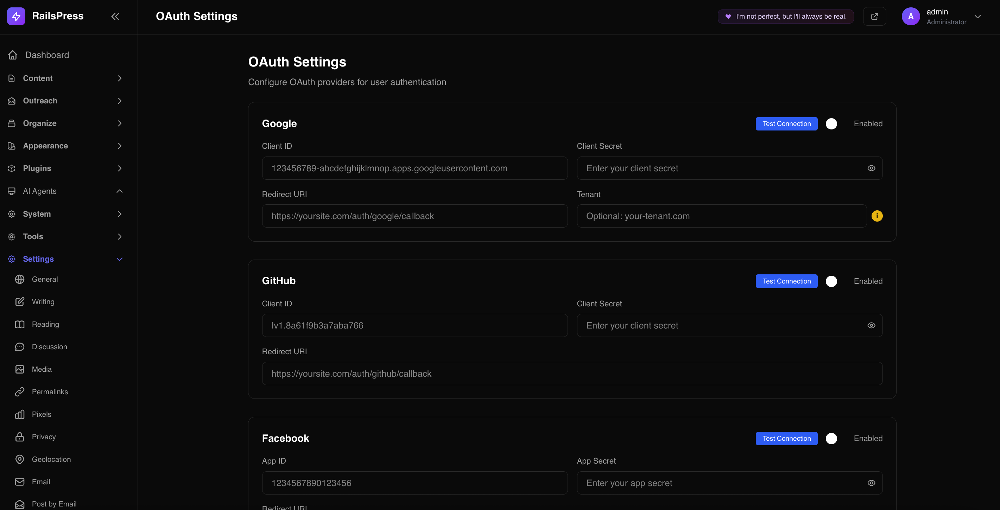

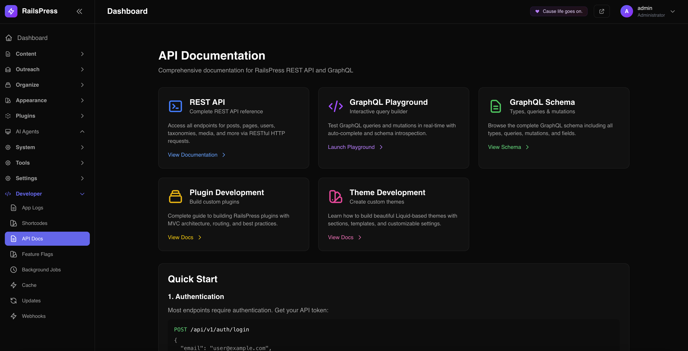

---

## 🔌 **API Quick Start**

### **REST API**

```bash
# Get API token
curl -X POST http://localhost:3000/api/v1/auth/login \
  -H "Content-Type: application/json" \
  -d '{"email":"admin@railspress.com","password":"password"}'

# Fetch posts
curl http://localhost:3000/api/v1/posts?status=published \
  -H "Authorization: Bearer YOUR_TOKEN"

# Create content
curl -X POST http://localhost:3000/api/v1/posts \
  -H "Authorization: Bearer YOUR_TOKEN" \
  -H "Content-Type: application/json" \
  -d '{
    "post": {
      "title": "New Post",
      "content": "<p>Content here</p>",
      "status": "published"
    }
  }'
```

### **GraphQL API**

```graphql
# Query posts with categories
query GetPosts {
  posts(limit: 10) {
    id
    title
    slug
    content
    publishedAt
    author {
      name
      email
    }
    categories {
      name
      slug
    }
  }
}

# Create a post
mutation CreatePost {
  createPost(input: {
    title: "New Post"
    content: "<p>Content here</p>"
    status: "published"
  }) {
    post {
      id
      title
      slug
    }
    errors
  }
}
```

### **AI Agents API**

```bash
# Execute AI agent
curl -X POST http://localhost:3000/api/v1/ai_agents/execute/content_summarizer \
  -H "Authorization: Bearer YOUR_TOKEN" \
  -H "Content-Type: application/json" \
  -d '{
    "input": "Your content to summarize",
    "options": {
      "max_length": 150
    }
  }'
```

---

## 🎨 **Theme Development**

### **Liquid Templates**

```liquid
<!-- templates/index.liquid -->


<div class="container mx-auto px-4 py-8">
  <h2 class="text-3xl font-bold mb-6">Latest Posts</h2>
  
  
    <article class="mb-8">
      <h3><a href="{{ post.url }}">{{ post.title }}</a></h3>
      <p>{{ post.excerpt }}</p>
      <time>{{ post.published_at | date: '%B %d, %Y' }}</time>
    </article>
  
</div>


```

### **Sections**

```json
{
  "name": "hero",
  "settings": [
    {
      "type": "text",
      "id": "title",
      "label": "Title",
      "default": "Welcome"
    },
    {
      "type": "textarea",
      "id": "subtitle",
      "label": "Subtitle"
    }
  ]
}
```

---

## 🔌 **Plugin Development**

### **Basic Plugin Structure**

```ruby
# lib/plugins/my_plugin/my_plugin.rb
class MyPlugin < Railspress::PluginBase
  plugin_name 'My Plugin'
  plugin_version '1.0.0'
  plugin_description 'A custom plugin for RailsPress'
  plugin_author 'Your Name'

  def activate
    super
    register_hooks
  end

  def deactivate
    super
    Rails.logger.info "My Plugin deactivated"
  end

  private

  def register_hooks
    add_action('post_published', :send_notification)
    add_filter('post_content', :enhance_content)
  end

  def send_notification(post)
    # Send notification logic
  end

  def enhance_content(content)
    # Enhance content logic
    content
  end
end
```

### **AI Agent Integration**

```ruby
# Create AI agent from plugin
def create_content_agent
  ai_agent = AiAgent.create!(
    name: 'Content Enhancer',
    agent_type: 'content_enhancer',
    description: 'Enhances content with AI',
    prompt: 'Enhance the following content: {{input}}',
    active: true
  )
  
  Rails.logger.info "Created AI agent: #{ai_agent.name}"
end
```

---

## 🛠️ **Technology Stack**

### **Backend**
- **Ruby on Rails 7.1+** - Web framework
- **PostgreSQL/SQLite3/MySQL** - Database (agnostic)
- **Liquid** - Templating engine
- **GraphQL** - API layer (graphql-ruby)
- **Devise** - Authentication
- **Pundit** - Authorization
- **Sidekiq** - Background jobs
- **Redis** - Caching and sessions

### **Frontend**
- **Liquid Templates** - Theme system
- **Tailwind CSS** - Admin styling
- **Hotwire** (Turbo & Stimulus) - Modern Rails UX
- **Custom Visual Builder** - Native drag-and-drop system
- **Tabulator.js** - Data tables
- **Vanilla JavaScript** - Theme interactions

### **AI & Integrations**
- **OpenAI API** - GPT models
- **Anthropic API** - Claude models
- **Cohere API** - Command models
- **Google AI** - PaLM/Gemini models
- **Webhook system** - Real-time integrations

---

## 📚 **Documentation**

### **Comprehensive Guides**
- 📖 **[Complete Documentation](docs/README.md)** - Master index
- 🚀 **[Quick Start Guide](docs/setup/quick-start.md)** - Get up and running
- 🎨 **[Theme Development](docs/themes/)** - Build custom themes
- 🔌 **[Plugin Development](docs/plugins/)** - Create plugins
- 🔌 **[API Documentation](docs/api/)** - REST & GraphQL APIs
- 🤖 **[AI Agents Guide](docs/features/ai-agents.md)** - AI integration
- 🔗 **[Webhooks Guide](docs/features/webhooks.md)** - Real-time integrations
- 🔒 **[GDPR Compliance Guide](docs/GDPR_COMPLIANCE_GUIDE.md)** - Privacy compliance
- 🍪 **[Consent Management](docs/consent/CONSENT_MANAGEMENT_SYSTEM.md)** - OneTrust-level features
- 🤖 **[MCP Implementation](docs/MCP_IMPLEMENTATION.md)** - Model Context Protocol

### **Quick References**
- 📋 **[API Quick Reference](docs/api/quick-reference.md)**
- 🎯 **[Shortcodes Reference](docs/reference/newsletter-shortcodes.md)**
- 🔧 **[CLI Reference](docs/development/cli-quick-reference.md)**
- 🎨 **[Theme Reference](docs/themes/themes_overview.md)**

---

## 🧪 **Testing**

### **Test Suite**
- ✅ **700+ tests** with 95% coverage
- ✅ **Model tests** - Data validation and relationships
- ✅ **Controller tests** - API endpoints and admin actions
- ✅ **Integration tests** - User flows and theme rendering
- ✅ **System tests** - End-to-end scenarios
- ✅ **API tests** - REST and GraphQL endpoints

### **Running Tests**

```bash
# Run all tests
bundle exec rspec

# Run specific test types
bundle exec rspec spec/models/
bundle exec rspec spec/controllers/
bundle exec rspec spec/integration/

# Run with coverage
COVERAGE=true bundle exec rspec
```

---

## 🚀 **Deployment**

### **Production Setup**

```bash
# Set environment variables
export RAILS_ENV=production
export SECRET_KEY_BASE=your_secret_key
export DATABASE_URL=your_database_url
export REDIS_URL=your_redis_url

# Precompile assets
rails assets:precompile

# Run migrations
rails db:migrate

# Start the server
rails server -e production
```

### **Recommended Hosting**
- **Heroku** - Easy deployment with add-ons
- **AWS** - Elastic Beanstalk or EC2
- **DigitalOcean** - Droplets with managed databases
- **Render** - Modern platform with auto-deploy
- **Fly.io** - Global edge deployment

### **Docker Support**
- ✅ **Dockerfile** included for containerization
- ✅ **Docker Compose** for local development
- ✅ **Multi-stage builds** for optimization

---

## 🤝 **Contributing**

We welcome contributions! Here's how you can help:

### **Ways to Contribute**
- 🐛 **Report bugs** and issues
- 💡 **Suggest features** and improvements
- 📝 **Improve documentation**
- 🔧 **Submit pull requests**
- 🧪 **Add tests** and improve coverage
- 🎨 **Create themes** and plugins

### **Development Setup**

```bash
# Fork and clone the repository
git clone https://github.com/your-username/railspress.git
cd railspress

# Install dependencies
bundle install

# Setup database
rails db:create db:migrate db:seed

# Run tests
bundle exec rspec

# Start development server
./bin/dev
```

### **Pull Request Process**
1. Fork the repository
2. Create a feature branch
3. Make your changes
4. Add tests for new functionality
5. Ensure all tests pass
6. Submit a pull request

---

## 📊 **Project Status**

### **Current Status: ✅ PRODUCTION READY**

- **Version**: 2.0
- **Test Coverage**: 95%+
- **Documentation**: Complete
- **Features**: All core features implemented
- **Performance**: Optimized for production
- **Security**: Hardened and secure

### **What's Working**
- ✅ **All page types** (homepage, blog, pages, archives)
- ✅ **Custom visual builder** with native drag-and-drop
- ✅ **Admin panel** with responsive design
- ✅ **API system** (REST + GraphQL)
- ✅ **AI agents** with multiple providers
- ✅ **Plugin system** with marketplace
- ✅ **Webhook system** with real-time delivery
- ✅ **Email system** with multiple providers
- ✅ **User management** with roles
- ✅ **Content management** with rich editing
- ✅ **GDPR compliance** with full data subject rights
- ✅ **Consent management** with OneTrust-level features
- ✅ **MCP integration** for AI model connectivity
- ✅ **Content channels** for multi-platform distribution
- ✅ **Distraction-free writing** with Notion-style editor
- ✅ **GDPR-compliant analytics** with privacy-first design

---

## 🏆 **Why Choose RailsPress?**

### **For Developers**
- 🚀 **Modern Rails 7.1** with Hotwire
- 🔌 **Complete API** (REST + GraphQL)
- 🎨 **Flexible theming** with Liquid
- 🔧 **Extensible** plugin architecture
- 🧪 **95% test coverage** for reliability
- 📚 **Comprehensive documentation**
- 🤖 **MCP integration** for AI connectivity
- 🔒 **GDPR compliance** built-in
- 📺 **Content channels** for multi-platform distribution

### **For Content Creators**
- ✍️ **Rich text editing** with Trix
- 🤖 **AI-powered** content assistance
- 📱 **Responsive** admin interface
- 🎯 **SEO optimization** built-in
- 📊 **Analytics integration** ready
- 🔒 **Secure** and reliable
- 🎨 **Custom visual builder** for easy design
- 🍪 **Consent management** for compliance
- 📺 **Multi-platform** content distribution
- ✍️ **Distraction-free writing** with Notion-style editor
- 📊 **Privacy-first analytics** without data collection

### **For Businesses**
- 🏢 **Enterprise-ready** with multi-tenancy
- 🔗 **Webhook integrations** for automation
- 📧 **Transactional emails** with tracking
- 🛡️ **Security features** and compliance
- 📈 **Scalable** architecture
- 💰 **Cost-effective** hosting options
- 🔒 **GDPR compliance** out of the box
- 🍪 **OneTrust-level** consent management
- 📺 **Omnichannel** content delivery
- 📊 **GDPR-compliant analytics** for privacy-conscious businesses

---

## 🚀 **We Are Looking For You!**

### **Join the RailsPress Community**

RailsPress is more than just a CMS - it's a platform for innovation and collaboration. We're actively seeking talented individuals to help shape the future of Rails-based content management.

### **🎨 Theme Developers**

**What We Need:**
- **Modern, responsive themes** using Liquid templating
- **Custom visual builder** integrations
- **Mobile-first designs** with Tailwind CSS
- **Accessibility-compliant** interfaces
- **Performance-optimized** layouts

**What You Get:**
- 🏆 **Featured placement** in our theme marketplace
- 💰 **Revenue sharing** for premium themes
- 🛠️ **Developer tools** and documentation
- 🌟 **Community recognition** and support
- 📚 **Comprehensive guides** and examples

**Get Started:** Check out our [Theme Development Guide](docs/themes/THEME_DEVELOPMENT_GUIDE.md)

### **🔌 Plugin Developers**

**What We Need:**
- **Functional plugins** extending RailsPress capabilities
- **API integrations** with popular services
- **E-commerce solutions** and payment gateways
- **SEO tools** and optimization plugins
- **Analytics integrations** and reporting tools

**What You Get:**
- 🏪 **Marketplace listing** with promotion
- 💵 **Monetization options** for premium plugins
- 🔧 **Plugin API** access and documentation
- 🧪 **Testing framework** and CI/CD support
- 🤝 **Technical support** from our team

**Get Started:** Explore our [Plugin Developer Guide](docs/PLUGIN_DEVELOPER_GUIDE.md)

### **🔗 Integrators & Consultants**

**What We Need:**
- **Custom implementations** for enterprise clients
- **Migration services** from WordPress/Drupal
- **Performance optimization** specialists
- **Security auditing** and compliance experts
- **Training and support** providers

**What You Get:**
- 🤝 **Partner program** with benefits
- 📋 **Certification program** for expertise
- 💼 **Lead generation** and referrals
- 🎓 **Training materials** and resources
- 🌐 **Global network** of RailsPress professionals

**Get Started:** Contact us at **partners@railspress.com**

### **🎯 How to Get Involved**

1. **🌟 Star our repository** and follow for updates
2. **📖 Read our documentation** and guides
3. **🛠️ Build something amazing** with RailsPress
4. **💬 Join our community** discussions
5. **📧 Reach out** to discuss opportunities

**Ready to contribute?** We'd love to hear from you!

- **Email**: railspress@gmail.com
- **Discord**: [Join our community](https://discord.gg/7UxssdBRs)
- **GitHub**: [Contribute to the project](https://github.com/railspress/railspress)

---

## 📄 **License**

This project is licensed under the **MIT License** - see the [LICENSE](LICENSE) file for details.

---

## 🙏 **Acknowledgments**

Built with ❤️ using Ruby on Rails and powered by:

- **Custom Visual Builder** - Native drag-and-drop system
- **Tailwind CSS** - Admin styling
- **Trix** - Rich text editor
- **Liquid** - Templating engine
- **GraphQL** - API layer
- **Sidekiq** - Background jobs
- **Redis** - Caching and sessions

---

<div align="center">

## 🌟 **Ready to Get Started?**

[](https://heroku.com/deploy?template=https://github.com/your-username/railspress)
[](https://render.com/deploy)

**RailsPress** - Bringing WordPress-like simplicity to Rails development.

[⭐ **Star us on GitHub**](https://github.com/your-username/railspress) • [🐛 **Report Issues**](https://github.com/your-username/railspress/issues) • [💬 **Join Discussions**](https://github.com/your-username/railspress/discussions)

---

*Made with ❤️ by the RailsPress team* · 
Fun extra: the built-in plugin **“Hello Tupac!”** drops a random Tupac quote in the admin topbar to keep spirits high while you build.

</div>